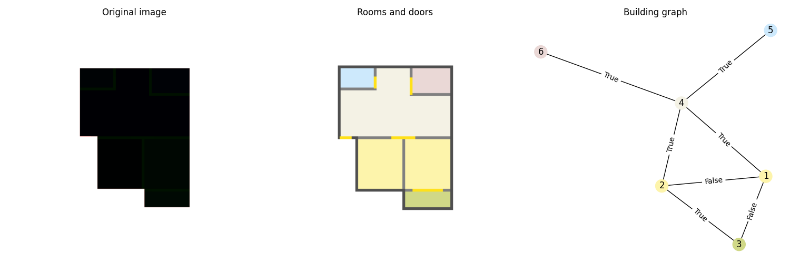

# rplanpy

Set of python utilities to work with the RPLAN dataset from 
"[Data-driven Interior Plan Generation for Residential Buildings](https://doi.org/10.1145/3355089.3356556)" paper.


## Data

This package works with the RPLAN image dataset, which consists of more than 80k floorplan 
images of real residential buildings, and can be obtained from the following 
[link](https://docs.google.com/forms/d/e/1FAIpQLSfwteilXzURRKDI5QopWCyOGkeb_CFFbRwtQ0SOPhEg0KGSfw/viewform)

## Examples

### Floorplan image to relation graph

Check an example converting a floorplan to a relation graph with node and edge attibutes in
[create_graph.py](create_graph.py). `True` in an edge means there is a door in the connection between two rooms.



## Citation

If you use this work please cite the original paper which collected the data.

```
@article{wu2019data,
  title={Data-driven interior plan generation for residential buildings},
  author={Wu, Wenming and Fu, Xiao-Ming and Tang, Rui and Wang, Yuhan and Qi, Yu-Hao and Liu, Ligang},
  journal={ACM Transactions on Graphics (TOG)},
  volume={38},
  number={6},
  pages={1--12},
  year={2019},
  publisher={ACM New York, NY, USA}
}

```
